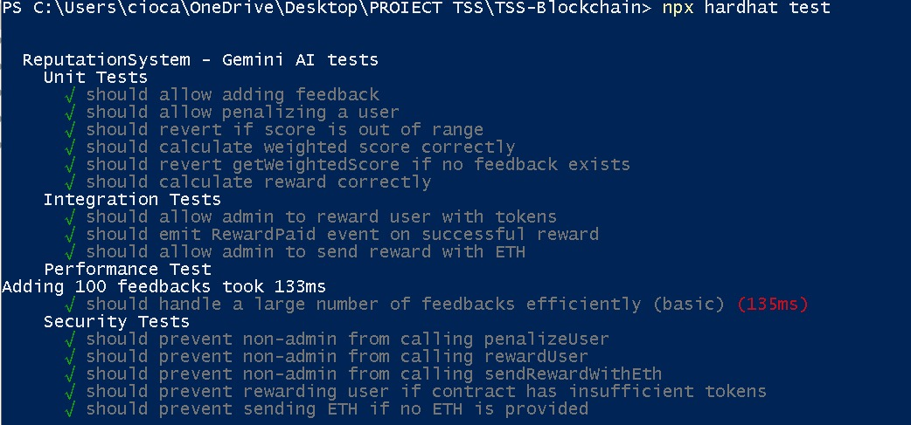

## 🎞️ Demo Vizual – Aplicație și Testare

### 🧩 Interfață aplicație


---

### 🧪 Rulare testare automată


### 🔍 Tema: *Testarea unei rețele Blockchain*

Testarea rețelelor blockchain este esențială pentru a garanta:
- **securitatea** tranzacțiilor,
- **consistența** datelor distribuite,
- **eficiența** contractelor smart,
- **scalabilitatea** aplicațiilor descentralizate (dApps).

---

## 🔧 Analiza aplicațiilor existente (avantaje/dezavantaje)

| Aplicație | Avantaje | Dezavantaje |
|-----------|----------|-------------|
| Remix IDE | Interfață rapidă pentru testare rapidă | Limitat la debugging și integrare locală |
| Truffle | Suită completă | Configurare complexă, lentă la testare masivă |
| **Hardhat** ✅ (ales) | Rapid, modern, ușor de integrat cu JS/TS, personalizabil | Necesită setup inițial în linie de comandă |

---

## ⚙️ Setup Inițial

### 📁 Structura proiectului

```
/contracts
  MyToken.sol
  ReputationSystem.sol
  WeightedCalculator.sol

/test
  unit/
  security/
  integration/
  performance/

/scripts
  deploy.js

/frontend
  index.html
  app.js
  style.css

hardhat.config.js
README.md
```

### Tool-uri folosite

| Tehnologie | Rol |
|------------|-----|
| **Solidity** | Limbaj pentru contractele inteligente |
| **Hardhat** | Compilare, testare, rețea locală |
| **Ethers.js** | Interacțiune frontend–smart contract |
| **Chai** | Framework de testare pentru JS |
| **MetaMask** | Portofel pentru simulare utilizator |
| **HTML/CSS/JS** | Interfață utilizator pentru dApp |

## 📦 Descriere Proiect

Acest proiect este o aplicație bazată pe tehnologia blockchain care implementează un **sistem de reputație**. Utilizatorii pot interacționa cu contractele inteligente pentru a oferi feedback, a vizualiza scoruri ponderate și a transfera token-uri. Administratorii beneficiază de privilegii suplimentare, precum recompensarea utilizatorilor, trimiterea de ETH și aplicarea de penalizări.

---

## ✨ Funcționalități

### 👤 Funcționalități pentru Utilizatori

- **Conectare Wallet**: Conectează-ți portofelul Ethereum pentru a interacționa cu aplicația.
- **Transfer Token-uri**: Trimite token-uri `MyToken` către orice adresă Ethereum.
- **Adaugă Feedback**: Oferă feedback altor utilizatori, cu scoruri între 1 și 5.
- **Verificare Scor Ponderat**: Vizualizează scorul de reputație al unui utilizator, calculat pe baza feedback-ului primit.

### 🛡️ Funcționalități pentru Administrator

- 🎁 **Recompensează Utilizatori cu Token-uri**: Trimite token-uri ca recompensă utilizatorilor activi.
- 🪙 **Trimite ETH**: Transferă Ether direct către portofelul unui utilizator.
- ⚠️ **Penalizează Utilizatori**: Adaugă feedback negativ pentru a reduce scorul de reputație al unui utilizator.

### ⚙️ Funcționalități Generale

- **Funcționalități pe Bază de Rol**: Interfața și acțiunile disponibile se adaptează în funcție de rolul utilizatorului (admin sau user).
- **Persistența Sesiunii**: Conexiunea cu wallet-ul se păstrează chiar și după reîncărcarea paginii.
- **Interfață Responsive**: Design modern, prietenos cu utilizatorul, cu temă gri.

---

## 🧪 Testare Unitară – Reputation System

Acest proiect include o suită de **teste unitare** pentru contractul inteligent `ReputationSystem`. Scopul acestor teste este de a valida logica principală a fiecărei funcții și de a asigura că sistemul se comportă conform așteptărilor în diferite condiții.

### ✅ Ce testăm

| Caz de testare                                 | Descriere                                                                 |
|------------------------------------------------|---------------------------------------------------------------------------|
| `addFeedback`                                  | Utilizatorii pot adăuga scoruri de feedback între 1 și 5.                 |
| `scor de feedback invalid`                     | Scorurile sub 1 sau peste 5 sunt respinse.                                |
| `onlyAdmin: penalizeUser()`                    | Doar proprietarul contractului poate penaliza utilizatori.               |
| `penalizeUser()`                               | Scade scorul de reputație al utilizatorului pe baza penalizării.          |
| `rewardUser()`                                 | Administratorul poate recompensa utilizatorii cu token-uri.              |
| `sendRewardWithEth()`                          | Administratorul poate trimite ETH utilizatorilor.                        |
| `multiple feedbacks`                           | Media ponderată este calculată corect din mai multe scoruri.              |
| `eveniment: FeedbackAdded`                     | Se emite un eveniment când este adăugat un feedback.                      |
| `sold insuficient de token-uri`                | Tranzacția este anulată dacă contractul nu are fonduri pentru recompense. |
| `getWeightedScore` (funcție `view` publică)    | Oricine poate vedea scorul de reputație al unui utilizator.               |

---

### 🛠 Tehnologii utilizate

- **Hardhat** – Mediu de dezvoltare și testare pentru contracte inteligente.
- **Chai** – Bibliotecă de aserțiuni pentru validarea rezultatelor așteptate.
- **Mocha** – Motor de testare JavaScript, integrat în Hardhat.
- **Ethers.js** – Interfață pentru interacțiunea cu contractele inteligente în timpul testelor.

---
## ⚙️ Testare de Performanță – Reputation System

Această suită de teste evaluează **eficiența** și **scalabilitatea** contractului `ReputationSystem`. Scopul este de a observa timpii de execuție și consumul de gas în situații cu volum mare de date sau interacțiuni repetate.

### ✅ Ce testăm

| Caz de test                               | Descriere                                                                 |
|-------------------------------------------|---------------------------------------------------------------------------|
| `100 feedback-uri`                        | Măsurăm timpul necesar pentru a adăuga 100 de feedback-uri.              |
| `1000 feedback-uri (stress test)`         | Evaluăm comportamentul sistemului sub încărcare intensă.                  |
| `gas usage: addFeedback()`                | Afișează cantitatea de gas utilizată pentru adăugarea unui feedback.      |
| `gas usage: penalizeUser()`               | Afișează costul în gas pentru penalizarea unui utilizator.               |
| `gas usage: rewardUser()`                 | Afișează costul în gas pentru recompensarea unui utilizator cu tokeni.    |
| `gas usage: sendRewardWithEth()`          | Verificăm consumul de gas la trimiterea de ETH.                           |
| `feedback de la 20 utilizatori`           | Se măsoară timpul pentru feedback din 20 de conturi diferite.             |
| `50 penalizări repetate`                  | Măsurăm eficiența penalizărilor multiple aplicate aceluiași utilizator.   |
| `test combinat: feedback + penalizare + recompensă` | Scenariu mixt cu 50 de iterații ce implică toate acțiunile principale.   |
| `scor după 1000 feedback-uri`             | Verificăm acuratețea scorului în cazul unui volum mare de date.           |

### 🛠 Tehnologii Folosite

- **Hardhat** – Mediu de dezvoltare pentru contracte inteligente.
- **Chai** – Aserțiuni pentru validarea rezultatelor.
- **Ethers.js** – Interacțiune cu blockchain-ul.
- **perf_hooks** – Măsurarea timpilor de execuție în Node.js.

## 🔐 Testare de Securitate – Reputation System

Această suită de teste validează comportamentele contractului `ReputationSystem` în fața situațiilor critice și a potențialelor atacuri. Sunt verificate permisiunile, validarea inputurilor și protecția contra adreselor invalide sau interacțiunilor neautorizate.

### ✅ Ce testăm

| Caz de test                                      | Descriere                                                                 |
|--------------------------------------------------|---------------------------------------------------------------------------|
| `onlyAdmin: penalizeUser()`                      | Doar adminul poate penaliza un utilizator.                                |
| `onlyAdmin: rewardUser()`                        | Doar adminul poate trimite tokeni ca recompensă.                          |
| `onlyAdmin: sendRewardWithEth()`                 | Doar adminul poate trimite ETH utilizatorilor.                            |
| `invalid feedback score`                         | Scorurile <1 sau >5 sunt respinse.                                        |
| `invalid penalty score`                          | Penalizările cu scoruri invalide sunt respinse.                           |
| `self-feedback permis`                           | Un utilizator își poate oferi feedback (dacă nu este interzis explicit).  |
| `getWeightedScore` (public view)                 | Oricine poate citi scorul de reputație al altuia.                         |
| `no direct score manipulation`                   | Nu există metode publice pentru manipularea directă a scorului.           |
| `spam feedback (50)`                             | Sistemul permite multiple feedbackuri, dacă nu este limitat explicit.     |
| `ETH fallback protection`                        | Contractul respinge transferuri ETH directe, fără funcție `receive()`.    |

### 🛠 Tehnologii Folosite

- **Hardhat** – Mediu de testare și dezvoltare Ethereum.
- **Chai** – Aserțiuni pentru comportamentele așteptate.
- **Ethers.js** – Interacțiuni cu contractele inteligente.

## 🔄 Testare de Integrare – Reputation System

Această suită de teste validează interacțiunea dintre componentele principale ale sistemului: contractul `ReputationSystem`, token-ul ERC-20 și biblioteca `WeightedCalculator`. Scopul este de a simula scenarii reale în care mai multe funcționalități sunt utilizate în succesiune.

### ✅ Ce testăm

| Caz de test                                                  | Descriere                                                                 |
|--------------------------------------------------------------|---------------------------------------------------------------------------|
| `user feedback + scor + recompensă`                          | Utilizatorul primește feedback, i se calculează scorul și este recompensat. |
| `feedback multiplu + penalizare`                             | Verifică dacă penalizarea reduce scorul calculat din feedbackuri multiple. |
| `recompensă în ETH`                                          | După feedback, utilizatorul primește ETH direct de la contract.           |
| `feedback pentru mai mulți utilizatori`                      | Asigură scoruri independente pentru fiecare utilizator.                   |
| `penalizarea afectează doar utilizatorul vizat`              | Doar scorul utilizatorului penalizat se modifică.                         |
| `recompensă în tokeni pentru mai mulți utilizatori`          | Fiecare utilizator primește cantitatea corectă de tokeni.                 |
| `recompensă în ETH pentru mai mulți utilizatori`             | Se trimite ETH la mai multe adrese și balanțele cresc corespunzător.     |
| `penalizare fără feedback anterior`                          | Penalizarea poate fi aplicată chiar dacă nu există feedback anterior.     |
| `penalizare și recompensă pentru același utilizator`         | Testează coexistența acțiunilor negative și pozitive asupra scorului.     |
| `feedback de la utilizatori diferiți către aceeași adresă`   | Se calculează corect scorul mediu ponderat din feedbackuri multiple.      |

### 🛠 Tehnologii Folosite

- **Hardhat** – Mediu de dezvoltare pentru smart contracts.
- **Chai** – Bibliotecă de aserțiuni pentru validare.
- **Mocha** – Framework de testare pentru JavaScript.
- **Ethers.js** – Interacțiune cu contractele pe blockchain.

## 🤖 Testare asistată de AI – Gemini (Google)

Pentru a evalua capacitatea unui tool AI de a genera teste automatizate pentru smart contracts, am utilizat [**Gemini**](https://gemini.google.com/) – un model AI dezvoltat de Google.

### 📥 Prompt trimis către Gemini

Generate unit tests, integration tests, performance tests and security tests for the following Solidity smart contracts deployed on a local Hardhat Ethereum network. Use Hardhat + Chai for testing.


Au fost incluse în prompt următoarele contracte:
- `ReputationSystem.sol`
- `MyToken.sol`
- `WeightedCalculator.sol`

---

### 📄 Teste generate de Gemini

AI-ul a generat un fișier de test ce conținea:
- Câteva teste unitare de bază (`addFeedback`, `penalizeUser`)
- 2 teste de integrare (`rewardUser`, `sendRewardWithEth`)
- 1 test de performanță simplificat (10 feedbackuri într-o buclă)
- Câteva teste de securitate legate de `onlyAdmin` și scoruri invalide

<details>
  <summary>📸 Vezi captură de ecran cu testele rulate</summary>

  

</details>

---

### ❌ Probleme la rulare (Hardhat)

Inițial, testele generate de Gemini **nu rulau**, din cauza:
- Lipsa importului `ethers.parseEther` → `TypeError: Cannot read properties of undefined`
- Folosirea greșită a `ethers.BigNumber.from(...)`
- Lipsa `beforeEach` consistent, ceea ce ducea la referințe `undefined`
- Lipsa setup-ului corect al contractelor (fără deploy, fără ownership)
- Niciun test pentru `event FeedbackAdded`, edge cases, scoruri negative, sau adresă zero

---

### 🧠 Comparație între Testele AI și Testele Proprii

| Funcționalitate                | Test AI (Gemini)                     | Test propriu                         |
|-------------------------------|--------------------------------------|--------------------------------------|
| `addFeedback`                 | Test minim (scor = 4)                | Test scor corect + scor invalid + timestamp |
| `penalizeUser`                | Doar test pentru acces `onlyAdmin`  | Test scor negativ, invalid, penalizare user 0 |
| `getWeightedScore`           | Test simplu fără timestamp           | Test cu manipulare timp + calcul scor ponderat |
| `rewardUser`                 | Fără setup token                     | Test cu transfer token, balans inițial + final |
| `sendRewardWithEth`          | Fără test balans                     | Test balans ETH inițial + final, revert fără ETH |
| `performance`                | Doar `Date.now()` JS                 | Test real cu 100 feedbackuri + limită de timp |
| `security`                   | Doar `onlyAdmin`                     | Include adresă zero, self-feedback, fallback |

---

### 🧾 Concluzie

Deși Gemini oferă o bază de pornire pentru testare automată, testele generate:
- sunt incomplete și neoptimizate,
- nu acoperă cazuri-limită sau evenimente,
- conțin erori de sintaxă și lipsă de context blockchain,
- necesită corectare manuală semnificativă.

📌 **Testele dezvoltate manual** sunt mai robuste, validate, și acoperă corect funcționalitatea sistemului în condiții reale.

---
### 📚 Resurse și articole științifice/documentații studiate

| Nr | Sursa | Tip | Conținut |
|----|-------|-----|----------|
| [1] | [Ethereum Whitepaper](https://ethereum.org/en/whitepaper/) | Web | Bază pentru înțelegerea contractelor inteligente |
| [2] | Atzei, Bartoletti, Cimoli – *A Survey of Attacks on Ethereum Smart Contracts* | PDF Articol | Identifică vulnerabilități testabile |
| [3] | [Hardhat Docs](https://hardhat.org/docs) | Web | Instrument de testare pentru Solidity |
| [4] | [OpenZeppelin Docs](https://docs.openzeppelin.com/contracts/) | Web | Util pentru contracte ERC20 și controale de acces |
| [5] | [Chai Assertions](https://www.chaijs.com/api/bdd/) | Web | Pentru structurarea testelor în JS |

---
