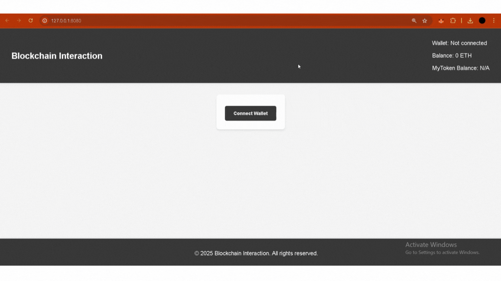

## 🎞️ Demo Vizual – Aplicație și Testare

### 🧩 Interfață aplicație



---

### 🧪 Rulare testare automată


# ✅ 1/3 Implementare – Versiune Alpha-Alpha

Aceasta este versiunea incipientă a aplicației de testare a unei rețele blockchain. În această etapă am realizat documentarea, cercetarea prealabilă și am pregătit configurația de bază a mediului de lucru.

---

## Analiză și documentare

### 🔍 Tema: *Testarea unei rețele Blockchain*

Testarea rețelelor blockchain este esențială pentru a garanta:
- **securitatea** tranzacțiilor,
- **consistența** datelor distribuite,
- **eficiența** contractelor smart,
- **scalabilitatea** aplicațiilor descentralizate (dApps).

---

### 📚 Resurse și articole științifice/documentații studiate

| Nr | Sursa | Tip | Conținut |
|----|-------|-----|----------|
| [1] | [Ethereum Whitepaper](https://ethereum.org/en/whitepaper/) | Web | Bază pentru înțelegerea contractelor inteligente |
| [2] | Atzei, Bartoletti, Cimoli – *A Survey of Attacks on Ethereum Smart Contracts* | PDF Articol | Identifică vulnerabilități testabile |
| [3] | [Hardhat Docs](https://hardhat.org/docs) | Web | Instrument de testare pentru Solidity |
| [4] | [OpenZeppelin Docs](https://docs.openzeppelin.com/contracts/) | Web | Util pentru contracte ERC20 și controale de acces |
| [5] | [Chai Assertions](https://www.chaijs.com/api/bdd/) | Web | Pentru structurarea testelor în JS |

---

## 🔧 Analiza aplicațiilor existente (avantaje/dezavantaje)

| Aplicație | Avantaje | Dezavantaje |
|-----------|----------|-------------|
| Remix IDE | Interfață rapidă pentru testare rapidă | Limitat la debugging și integrare locală |
| Truffle | Suită completă | Configurare complexă, lentă la testare masivă |
| **Hardhat** ✅ (ales) | Rapid, modern, ușor de integrat cu JS/TS, personalizabil | Necesită setup inițial în linie de comandă |

---

## ⚙️ Setup Inițial

### 📁 Structura proiectului

```
/contracts
  MyToken.sol
  ReputationSystem.sol
  WeightedCalculator.sol

/test
  unit/
  security/
  integration/
  performance/

/scripts
  deploy.js

/frontend
  index.html
  app.js
  style.css

hardhat.config.js
README.md
```

### Tool-uri folosite

| Tehnologie | Rol |
|------------|-----|
| **Solidity** | Limbaj pentru contractele inteligente |
| **Hardhat** | Compilare, testare, rețea locală |
| **Ethers.js** | Interacțiune frontend–smart contract |
| **Chai** | Framework de testare pentru JS |
| **MetaMask** | Portofel pentru simulare utilizator |
| **HTML/CSS/JS** | Interfață utilizator pentru dApp |

## 📦 Descriere Proiect

Acest proiect este o aplicație bazată pe tehnologia blockchain care implementează un **sistem de reputație**. Utilizatorii pot interacționa cu contractele inteligente pentru a oferi feedback, a vizualiza scoruri ponderate și a transfera token-uri. Administratorii beneficiază de privilegii suplimentare, precum recompensarea utilizatorilor, trimiterea de ETH și aplicarea de penalizări.

---

## ✨ Funcționalități

### 👤 Funcționalități pentru Utilizatori

- **Conectare Wallet**: Conectează-ți portofelul Ethereum pentru a interacționa cu aplicația.
- **Transfer Token-uri**: Trimite token-uri `MyToken` către orice adresă Ethereum.
- **Adaugă Feedback**: Oferă feedback altor utilizatori, cu scoruri între 1 și 5.
- **Verificare Scor Ponderat**: Vizualizează scorul de reputație al unui utilizator, calculat pe baza feedback-ului primit.

### 🛡️ Funcționalități pentru Administrator

- 🎁 **Recompensează Utilizatori cu Token-uri**: Trimite token-uri ca recompensă utilizatorilor activi.
- 🪙 **Trimite ETH**: Transferă Ether direct către portofelul unui utilizator.
- ⚠️ **Penalizează Utilizatori**: Adaugă feedback negativ pentru a reduce scorul de reputație al unui utilizator.

### ⚙️ Funcționalități Generale

- **Funcționalități pe Bază de Rol**: Interfața și acțiunile disponibile se adaptează în funcție de rolul utilizatorului (admin sau user).
- **Persistența Sesiunii**: Conexiunea cu wallet-ul se păstrează chiar și după reîncărcarea paginii.
- **Interfață Responsive**: Design modern, prietenos cu utilizatorul, cu temă gri.


---
## 🎯 Obiectivul versiunii Alpha-Alpha

- Documentare completă despre testarea blockchain
- Alegerea tehnologiilor și framework-urilor potrivite
- Setup complet de proiect Hardhat + frontend
- Primele contracte scrise (`MyToken`, `ReputationSystem`)
- Conectarea inițială wallet–frontend funcțională
- Primele teste de tip **unitare**

---
## 🧪 Testare Unitară – Reputation System

Acest proiect include o suită de **teste unitare** pentru contractul inteligent `ReputationSystem`. Scopul acestor teste este de a valida logica principală a fiecărei funcții și de a asigura că sistemul se comportă conform așteptărilor în diferite condiții.

### ✅ Ce testăm

| Caz de testare                                 | Descriere                                                                 |
|------------------------------------------------|---------------------------------------------------------------------------|
| `addFeedback`                                  | Utilizatorii pot adăuga scoruri de feedback între 1 și 5.                 |
| `scor de feedback invalid`                     | Scorurile sub 1 sau peste 5 sunt respinse.                                |
| `onlyAdmin: penalizeUser()`                    | Doar proprietarul contractului poate penaliza utilizatori.               |
| `penalizeUser()`                               | Scade scorul de reputație al utilizatorului pe baza penalizării.          |
| `rewardUser()`                                 | Administratorul poate recompensa utilizatorii cu token-uri.              |
| `sendRewardWithEth()`                          | Administratorul poate trimite ETH utilizatorilor.                        |
| `multiple feedbacks`                           | Media ponderată este calculată corect din mai multe scoruri.              |
| `eveniment: FeedbackAdded`                     | Se emite un eveniment când este adăugat un feedback.                      |
| `sold insuficient de token-uri`                | Tranzacția este anulată dacă contractul nu are fonduri pentru recompense. |
| `getWeightedScore` (funcție `view` publică)    | Oricine poate vedea scorul de reputație al unui utilizator.               |

---

### 🛠 Tehnologii utilizate

- **Hardhat** – Mediu de dezvoltare și testare pentru contracte inteligente.
- **Chai** – Bibliotecă de aserțiuni pentru validarea rezultatelor așteptate.
- **Mocha** – Motor de testare JavaScript, integrat în Hardhat.
- **Ethers.js** – Interfață pentru interacțiunea cu contractele inteligente în timpul testelor.

---
## ⚙️ Testare de Performanță – Reputation System

Această suită de teste evaluează **eficiența** și **scalabilitatea** contractului `ReputationSystem`. Scopul este de a observa timpii de execuție și consumul de gas în situații cu volum mare de date sau interacțiuni repetate.

### ✅ Ce testăm

| Caz de test                               | Descriere                                                                 |
|-------------------------------------------|---------------------------------------------------------------------------|
| `100 feedback-uri`                        | Măsurăm timpul necesar pentru a adăuga 100 de feedback-uri.              |
| `1000 feedback-uri (stress test)`         | Evaluăm comportamentul sistemului sub încărcare intensă.                  |
| `gas usage: addFeedback()`                | Afișează cantitatea de gas utilizată pentru adăugarea unui feedback.      |
| `gas usage: penalizeUser()`               | Afișează costul în gas pentru penalizarea unui utilizator.               |
| `gas usage: rewardUser()`                 | Afișează costul în gas pentru recompensarea unui utilizator cu tokeni.    |
| `gas usage: sendRewardWithEth()`          | Verificăm consumul de gas la trimiterea de ETH.                           |
| `feedback de la 20 utilizatori`           | Se măsoară timpul pentru feedback din 20 de conturi diferite.             |
| `50 penalizări repetate`                  | Măsurăm eficiența penalizărilor multiple aplicate aceluiași utilizator.   |
| `test combinat: feedback + penalizare + recompensă` | Scenariu mixt cu 50 de iterații ce implică toate acțiunile principale.   |
| `scor după 1000 feedback-uri`             | Verificăm acuratețea scorului în cazul unui volum mare de date.           |

### 🛠 Tehnologii Folosite

- **Hardhat** – Mediu de dezvoltare pentru contracte inteligente.
- **Chai** – Aserțiuni pentru validarea rezultatelor.
- **Ethers.js** – Interacțiune cu blockchain-ul.
- **perf_hooks** – Măsurarea timpilor de execuție în Node.js.

### ▶️ Rulare teste unitare

```bash
npx hardhat test
```
